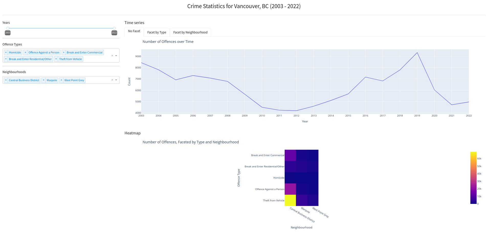

# VPD Crime Data Exploration (`vpd-crime-data-exploration`)

> Project complete in accordance with DSCI 532 for the UBC MDS Program 2022-23

## About

The repository hosts the source code of an exploration of the [VPD Crime Data](https://geodash.vpd.ca/opendata/). For information on the intention, research questions, as well as a more detailed description of the data, please read the [proposal](_docs/proposal.md) instead.

The objective of this dashboard it to enable users to make inferences on the (aggregated) crime data in Vancouver, BC between 2003 to 2022.

## Usage

The latest version at `master` is deployed [here](https://vpd-crime-data-exploration.onrender.com).



On the left, the user can choose to drill down on the aggregated crime data. The three filters are:
- Year (defaulted to 2003 - 2022)
- Offence Types
- Neighbourhoods

After the selection, the user can see the plots on the right updated on the fly. On the top, there is a time series line chart. By choosing other tabs there, the user can choose not to facet the data, facet it by offence type, and facet it by neighbourhood. At the bottom, there is a heatmap which plots offence type against neighbourhood.

## Usage (Advanced)

If you are considering to contribute, hack, or simply fork this app, great! Before moving on, make sure your computer has Python development environment set up. IDEs like Visual Studio Code are optional. Developing on POSIX (Linux) or Mac is recommmended, but Windows should also work.

### Download the Code

The latest copy of this code can be downloaded by:

```bash
git clone https://github.com/netsgnut/vpd-crime-data-exploration
cd vpd-crime-data-exploration
```

### Create a `virtualenv`

Create a `virtualenv` under the folder `.venv`, in the project root folder.

(Note that you can also use other tools to create a virtual environment.)

```bash
python -m venv .venv
```

### Use the `virtualenv`

```bash
. .venv/bin/activate
```

### Install the dependencies

```bash
pip install -r src/requirements.txt
```

### Run it!

To run it via Flask locally:

```bash
python src/app.py
```

Or, alternatively, you could enable the debug mode with:

```bash
DEBUG=1 python src/app.py
```

### (Optional) Data wrangling script

There is a script at [`src/process_data.py`](src/process_data.py) that reads the raw `crimedata_csv_AllNeighbourhoods_AllYears.csv` in `data/raw/` and process it to be `data/processed/crimedata_aggregated.csv`. Normally, you don't need to run it because both files are provided. But if you would like to tweak the parameters and/or update it to the latest dataset, you can modify the script there.

## Copyright and Licensing

The CSV files under `data/` directory are works/direct derivative of works from the [VPD Crime Data](https://geodash.vpd.ca/opendata/).

Copyright (c) 2003-2022 Vancouver Police Department

Unless otherwise specified, the materials in this repository are covered under this copyright statement:

Copyright (c) 2023 Kelvin Wong

The software and associated documentation files are licensed under the MIT License. You may find a copy of the license at [`LICENSE`](LICENSE).
